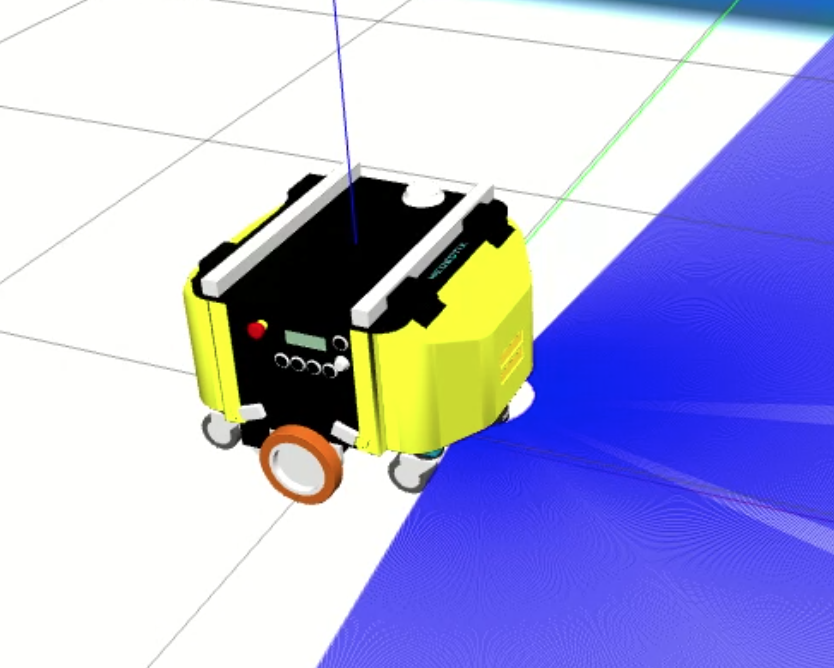

## Overview

This repository contains a comprehensive implementation of a robotics system using **ROS2** with C++. The system is designed to interact with multiple robotic components and includes examples of:

- **Subscribers**: Listen to incoming data streams.
- **Publishers**: Broadcast information to other nodes.
- **Services**:
  - Servers: Provide functionality upon request.
  - Clients: Request and receive data or actions from servers.
- **Actions**:
  - Action Servers: Handle long-running tasks with feedback and results.
  - Action Clients: Initiate and monitor action execution.
- **ROS2 Debugging Tools**: Techniques to debug nodes, topics, and system performance.
- **Node Composition**: Efficiently run multiple nodes in a single process for optimized resource usage.

## Features

- **Robust Communication**: Implements ROS2 communication paradigms to demonstrate real-time data exchange.
- **Modular Design**: Each component (subscriber, publisher, action server, etc.) is modularized for reusability and clarity.
- **ROS2 Debugging**: Tools and tips for debugging, including `ros2 topic echo`, `ros2 service call`, and `ros2 action list`.
- **Node Composition**: Examples of running nodes in both standalone and composable modes.
